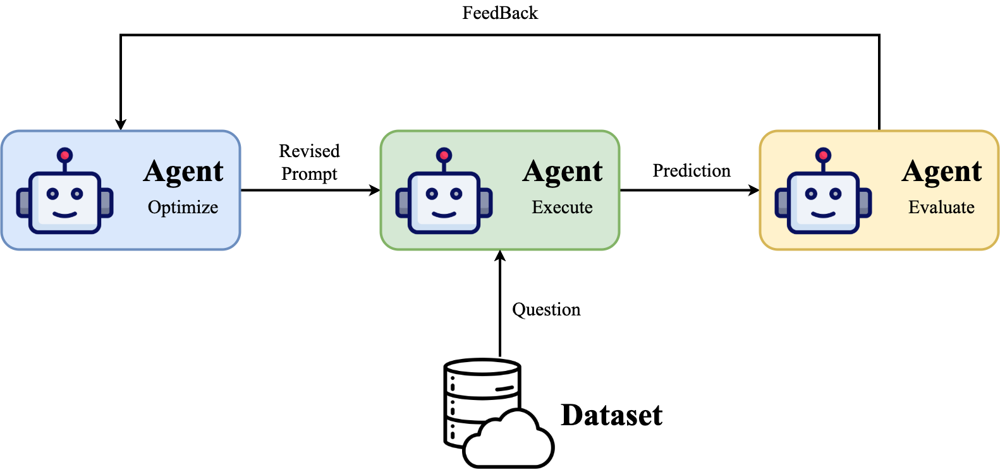

# prompt-optimization

## 🚀 What's New
## todo
- [ ] Add the `TextGrad` pipline.
- [ ] Modify the readme.

## 🔥 0722
- We add the `Protegi` pipline shell script in `examples/protegi_pipline.sh`.
- We support the protegi on gsm8k dataset.
- We support save the best prompt in the `Protegi` pipline.

## 🔥🔥🔥 0721
- We add the `Protegi` pipline, due to the complexness of reconstructing pipline from the original code, we modify the source codes directly. Thus, `Protegi` pipline is not integrated into the entry of `src/main.py`. And we will try our best to integrate it in the future.

## 🔥 0718
- Fix some bugs in the `src/main.py` and `src/config/pipline_config.py`.

## 🔥🔥🔥 0717-Night
- We add the `Rephrase` pipline, which is a simple pipline that only add the `Rephrase and expand the question, and respond.` to the prompt.
- We add the `examples/rephrase_pipline.sh` to provide the example of how to use the `Rephrase` pipline.
- We support the `BBHObjectCounting` dataset, which you refer to the [docs/prepare_dataset.md](docs/prepare_dataset.md) and config file in `src/config/dataset_config.py`.

## 🔥🔥 0717-Afternoon
- We add the `StepBack` pipline, which comprises of two parts: abstraction and reasoning.
- We add the `examples/stepback_pipline.sh` to provide the example of how to use the `StepBack` pipline.
- We modify the logic of the answer extraction in the `src/pipline/direct.py`.

## 🔥🔥🔥 0717-Morning
- We add the `ZeroCoT` pipline, which is a simple pipline that only add the `Let's think step by step.` to the prompt.
- We add the `examples/zerocot_pipline.sh` to provide the example of how to use the `ZeroCoT` pipline.
- We provide the results in the [Prompt Optimization Benchmark](https://dent-spleen-3fd.notion.site/Prompt-Optimization-Benchmark-23206678fdbe80cfa2f3cbd781d5fd4c).

## 🔥🔥 0716-Night
- We add the `AutoPipline` class to automatically instantiate the pipline according to the `pipline` parameter in the `src/main.py`. For more details, please refer to the `src/config/pipline_config.py`.
- We add the `examples` directory to provide the examples of how to use the project.
- We design more parameters in `src/main.py` to support more diverse piplines.

## 🔥🔥🔥 0716-Afternoon
> [!IMPORTANT]
> Only vllm and ollama backend support the reasoning model now.
- We support the reasoning model like Qwen3 series etc. Just set the `thinking` parameter in the `src/config/llm_config.py` to `True`.
- We support the `direct pipline` now. Model will directly output the result without `prompt optimization`, which serves as a baseline for comparison.
Just simply run the following command:
```bash
python src/main.py --pipline direct --model qwen3-14b_vllm --dataset liar --output_dir ./output
```

## 🔥🔥🔥 0715
We defined the core concept of using `configuration files` to control the entire project, including LLM, Dataset, and Pipeline.  
For model, please refer to the `src/config/llm_config.py`.  
For dataset, please refer to the `src/config/dataset_config.py`.  
For pipline, please refer to the `src/config/pipline_config.py`.  
Now, we can instantiate the LLM as simple as:
```python
from config import supported_llm
from llm import AutoLLM

llm_cfg = supported_llm['qwen3-14b_vllm']
llm = AutoLLM.build(llm_cfg)
print(llm.chat("hello"))
```
We can also instantiate the dataset as simple as:
```python
from config import supported_dataset
from dataset import AutoDataset

dataset_cfg = supported_dataset['liar']
dataset = AutoDataset.build(dataset_cfg)
```

## 🔥 0714
We create the structure of the project:
- `src/core`, the abstract class of the project including LLM, Agent, Dataset, Pipline etc.
- `src/llm`, the implementation of the LLM class including vllm, ollama, openai backend.
- `src/dataset`, the implementation of the dataset class including liar, gsm8k etc.
- `src/config`, the configuration of the project including llm, dataset, pipline etc.
- `src/pipline`, the implementation of the pipline class including direct, chain-of-thought, etc.
- `src/main.py`, the main entry of the project.

## Installation
```bash
git clone https://github.com/gxlover0625/prompt-optimization.git
cd prompt-optimization
conda create -n prompt-optimization python=3.11
conda activate prompt-optimization
pip install -r requirements.txt
```

## 📊 Data Preparation
Please refer to the [docs/prepare_dataset.md](docs/prepare_dataset.md).

## 📖 Model Preparation
Please refer to the [docs/prepare_model.md](docs/prepare_model.md).

## 📝 Main Concept

There are three agents in the process of prompt-optimization:
- Execution Agent: execute the task, according to the prompt given by the Optimization Agent.
- Evaluation Agent: evaluate the result of the Execution Agent. It can be a method or a judge model.
- Optimization Agent: optimize the prompt according to the feedback (also known as `text-gradient`) of the Evaluation Agent.

> [!NOTE]
> There are explanations of the parameters in the `src/main.py`.
- pipline: the pipline to use, must be the key in the `src/config/pipline_config.py`.
- model: (1) the model to use, must be the key in the `src/config/llm_config.py`. (2) If set this parameter, all the `*_agent` parameters in the `pipline_config.py` will be set the same as the model.
- execution_agent: the execution agent to use, if pipline contains this component and you set this parameter, the `execution_agent` in the `pipline_config.py` will be overridden.
- evaluation_agent: the evaluation agent to use, if pipline contains this component and you set this parameter, the `evaluation_agent` in the `pipline_config.py` will be overridden. Default is the metric provided by the dataset.
- optimization_agent: the optimization agent to use, if pipline contains this component and you set this parameter, the `optimization_agent` in the `pipline_config.py` will be overridden.
- dataset: the dataset to use, must be the key in the `src/config/dataset_config.py`.
- output_dir: the directory to save the results.

## 🏗️ ️QuickStart
Before evaluation, you need to read the [Data Preparation](#-data-preparation) and [Model Preparation](#-model-preparation) first.
> [!IMPORTANT]
> We recommend you to use the script in the `examples` directory to run the project.
```bash
git clone https://github.com/gxlover0625/prompt-optimization.git
cd prompt-optimization/examples
bash direct_pipline.sh
```
- Different piplines may have different parameters, you can change the script to run the pipline you want.  
- If you want to change the parameters, you can modify the script directly.
- After running, you will get the results in the `output/Direct_Qwen3-14B_Liar_{timestamp}/results.json`
> [!NOTE]
> There is an alternative way to run the project, which is to run the `src/main.py` directly.
```bash
git clone https://github.com/gxlover0625/prompt-optimization.git
cd prompt-optimization # !!! please make sure you are in the root directory of the project

# direct run Qwen3-14B on Liar dataset
python src/main.py --pipline direct --model qwen3-14b_vllm --dataset liar --output_dir ./output
```

## Results
All the results are saved in the [Prompt Optimization Benchmark](https://dent-spleen-3fd.notion.site/Prompt-Optimization-Benchmark-23206678fdbe80cfa2f3cbd781d5fd4c)

## 🤝 Acknowledgements
We were inspired by the excellent open-source project [OpenCompass](https://github.com/open-compass/opencompass), which helped simplify our development. Additionally, we would like to thank the following open-source projects for their code contributions.
- [OpenCompass](https://github.com/open-compass/opencompass) , is an LLM evaluation platform, supporting a wide range of models (Llama3, Mistral, InternLM2,GPT-4,LLaMa2, Qwen,GLM, Claude, etc) over 100+ datasets.
- [LMOps](https://github.com/microsoft/LMOps) , general technology for enabling AI capabilities w/ LLMs and MLLMs